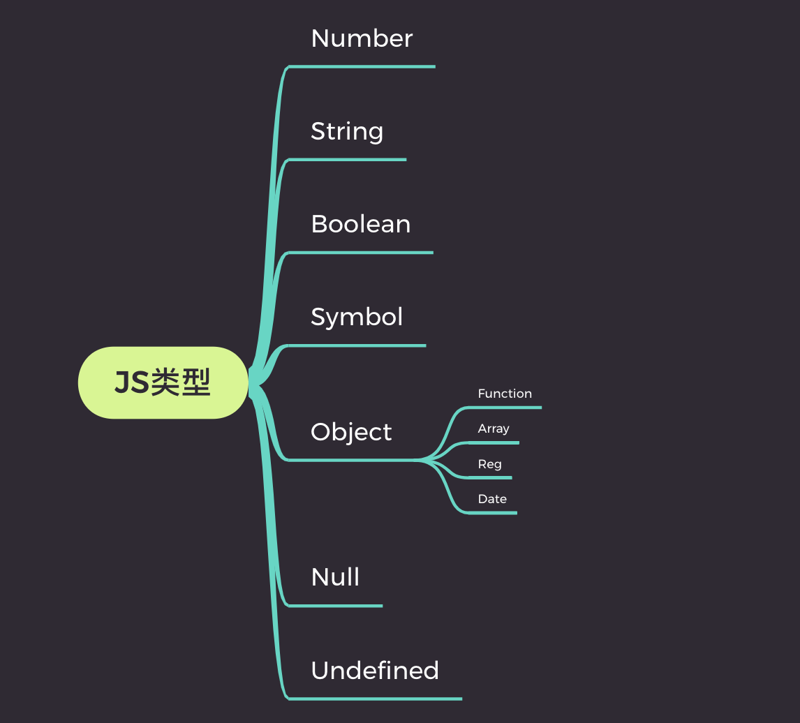

# js的类型



## Number 数字

`JavaScript` 采用“`IEEE 754` 标准定义的双精度64位格式”（`"double-precision 64-bit format IEEE 754 values"`）表示数字。和其他编程语言（如 `C` 和 `Java`）不同，`JavaScript` 不区分整数值和浮点数值，所有数字在 `JavaScript` 中均用浮点数值表示。

```javascript
0.1 + 0.2 = 0.30000000000000004
```

`javascript`能够表示的整数范围是`-2^53~2^53`,如果超出这个范围的整数，则无法保证低位数字的精准度

### NaN 和 Infinity

`NaN`如果给定的字符串不存在数值形式，函数会返回一个特殊的值 `NaN`（`Not a Number` 的缩写）

可以使用内置函数 isNaN() 来判断一个变量是否为 NaN

```JavaScript
isNaN(undefined) // true
isNaN(Infinity) // false
isNaN('12') // false
```

`JavaScript` 还有两个特殊值：`Infinity`（正无穷）和 `-Infinity`（负无穷)

可以使用内置函数 `isFinite()` 来判断一个变量是否是一个有穷数， 如果类型为`Infinity`, `-Infinity` 或 `NaN`则返回`false`：

```JavaScript
isFinite(1/0); // false
isFinite(Infinity); // false
isFinite(NaN); // false
isFinite(-Infinity); // false

isFinite(0); // true
isFinite(2e64); // true

isFinite("0"); // true
```

### 指数运算符 **

```javascript
2 ** 3 // 8
// 相当于 2 ** (3 ** 2)
2 ** 3 ** 2
// 512
```

## String 字符串

