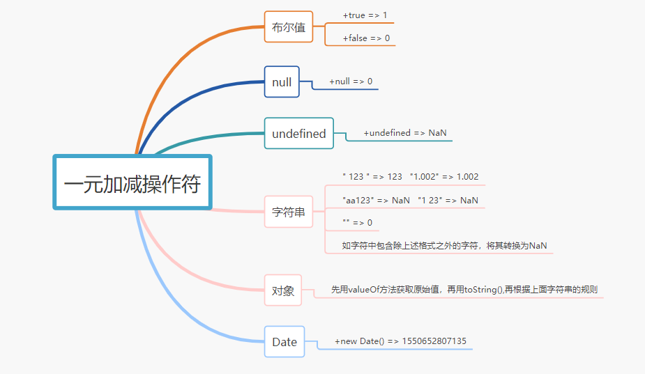

# 隐式类型转换

在 `JavaScript` 中，当我们进行比较操作或者加减乘除四则运算操作时，常常会触发 `JavaScript` 的隐式类型转换机制；而这部分也往往是令人迷惑的地方。譬如浏览器中的 `console.log` 操作常常会将任何值都转化为字符串然后展示，而数学运算则会首先将值转化为数值类型（除了 `Date` 类型对象）然后进行操作。

## js运算

首先先留下一些题目，如果这些题目都会了，那其实都了解的差不多了

```javascript

{} + []
({}+1)
0 + {}
{} + 0
[''] == false
[]==![]
1+ +"2"+"2"
.1+ +"2"+"2"
1-[]
1-![]

```

要想弄懂上面题目答案的原理，首先要彻底弄懂下面的概念

### 运算符优先级

运算符 | 描述
---|---
. [] () | 字段访问、数组下标、函数调用以及表达式分组
++ — - + ~ ! delete new typeof void | 一元运算符、返回数据类型、对象创建、未定义值
* / % | 乘法、除法、取模
+ - + | 加法、减法、字符串连接
<< >> >>> | 移位
< <= > >= instanceof | 小于、小于等于、大于、大于等于、instanceof
== != === !== |等于、不等于、严格相等、非严格相等
& | 按位与
^ | 按位异或
&& | 逻辑与
?: | 条件
= oP= | 赋值、运算赋值
, | 多重求值

### 一元加减操作符



一元加号（+）放在数值前面，对数值不会产生任何影响，在对非数值应用一元加操作符时，该操作符会像Number()转型函数一样对这个值执行转换

一元减号（-）放在数值前面，会改变数值的正负号。

在对非数值应用一元减操作符时，该操作符与一元加操作符遵循一样的规则，最后再将得到的数值转换为负数

### ==运算

## 一些资料

https://zhuanlan.zhihu.com/p/21650547

https://github.com/jawil/blog/issues/5

https://www.cnblogs.com/niulina/p/5699031.html

