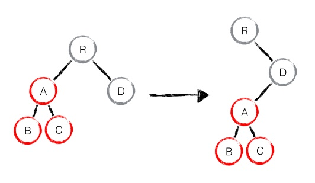

# 虚拟dom与diff算法

## 虚拟dom

虚拟dom: 只是一个简单的JS对象，并且最少包含tag、props和children三个属性 来表示一棵dom树。

例如:

```js
{
    tag: "div",
    props: {},
    children: [
        "Hello World",
        {
            tag: "ul",
            props: {},
            children: [{
                tag: "li",
                props: {
                    id: 1,
                    class: "li-1"
                },
                children: ["第", 1]
            }]
        }
    ]
}
```

## diff算法

传统的diff算法复杂度为O(n^3) 如果是10个节点则需要进行1000次比较
React 选用了启发式的算法，将时间复杂度控制在 O(n) 的级别。这个算法基于以下 2 个假设：

1、如果 2 个节点的类型不一样，以这 2 个节点为根结点的树会完全不同
2、对于多次 render 中结构保持不变的节点，开发者会用一个 key 属性标识出来，以便重用
另外，React 只会对同一层的节点作比较，不会跨层级比较，如图所示：


diff 使用的是深度优先算法，当遇到下图这样的情况



React 的做法比较简单，它会先删除整个 A 子树，然后再重新创建一遍。而不是将A剪切到D,因为这样需要跨层比较


同样道理，当 D 节点改为 G 节点时，整棵 D 子树也会被删掉，E、F 节点会重新创建

## 有key vs 无key

```js
<div id="app">
    <div v-for="i in dataList">{{ i }}</div>
</div>
var vm = new Vue({
  el: '#app',
  data: {
    dataList: [1, 2, 3, 4, 5]
  }
})

[
    '<div>1</div>', // id： A
    '<div>2</div>', // id:  B
    '<div>3</div>', // id:  C
    '<div>4</div>', // id:  D
    '<div>5</div>'  // id:  E
]
```

改变dataList数据，进行数据位置替换，对比改变后的数据

```js
 vm.dataList = [4, 1, 3, 5, 2] // 数据位置替换

 // 没有key的情况， 节点位置不变，但是节点innerText内容更新了
  [
    '<div>4</div>', // id： A
    '<div>1</div>', // id:  B
    '<div>3</div>', // id:  C
    '<div>5</div>', // id:  D
    '<div>2</div>'  // id:  E
  ]

  // 有key的情况，dom节点位置进行了交换，但是内容没有更新
  // <div v-for="i in dataList" :key='i'>{{ i }}</div>
  [
    '<div>4</div>', // id： D
    '<div>1</div>', // id:  A
    '<div>3</div>', // id:  C
    '<div>5</div>', // id:  E
    '<div>2</div>'  // id:  B
  ]
```

增删dataList列表项

```js

  vm.dataList = [3, 4, 5, 6, 7] // 数据进行增删

  // 1. 没有key的情况， 节点位置不变，内容也更新了
  [
    '<div>3</div>', // id： A
    '<div>4</div>', // id:  B
    '<div>5</div>', // id:  C
    '<div>6</div>', // id:  D
    '<div>7</div>'  // id:  E
  ]

  // 2. 有key的情况， 节点删除了 A, B 节点，新增了 F, G 节点
  // <div v-for="i in dataList" :key='i'>{{ i }}</div>
  [
    '<div>3</div>', // id： C
    '<div>4</div>', // id:  D
    '<div>5</div>', // id:  E
    '<div>6</div>', // id:  F
    '<div>7</div>'  // id:  G
  ]

```

从以上来看，不带有key，并且使用简单的模板，基于这个前提下，可以更有效的复用节点，diff速度来看也是不带key更加快速的，因为带key在增删节点上有耗时。这就是vue文档所说的[默认模式](https://cn.vuejs.org/v2/guide/list.html#%E7%BB%B4%E6%8A%A4%E7%8A%B6%E6%80%81)。但是这个并不是key作用，而是没有key的情况下可以对节点就地复用，提高性能。
在不带key的情况下，对于简单列表页渲染来说diff节点更快是没有错误的,如果是在复杂的列表，没有key的话更新数据可能需要重新新增节点 而有key的情况下则可以移动节点来实现
key的作用是为了在diff算法执行时更快的找到对应的节点，提高diff速度

## 参考文章


